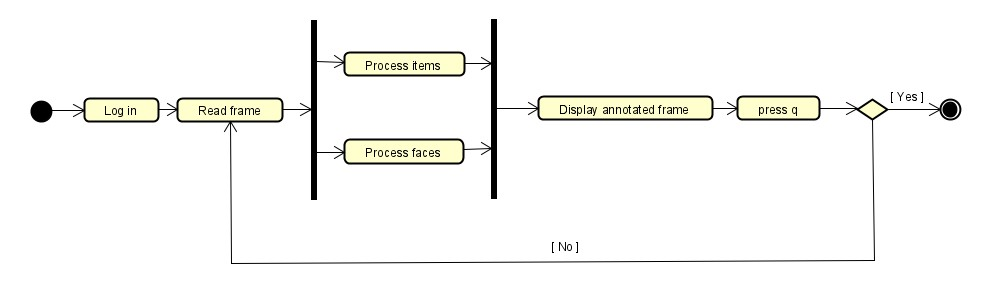
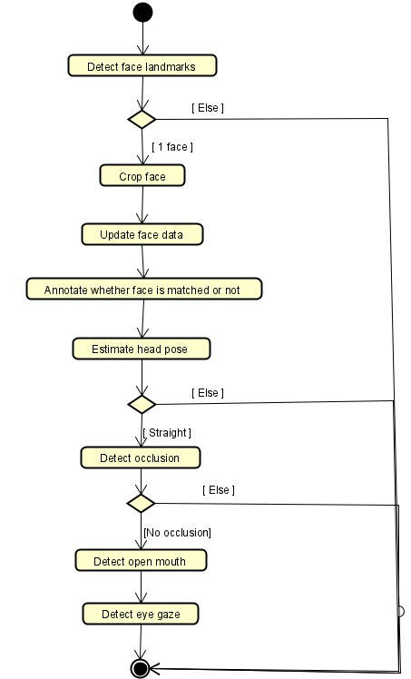
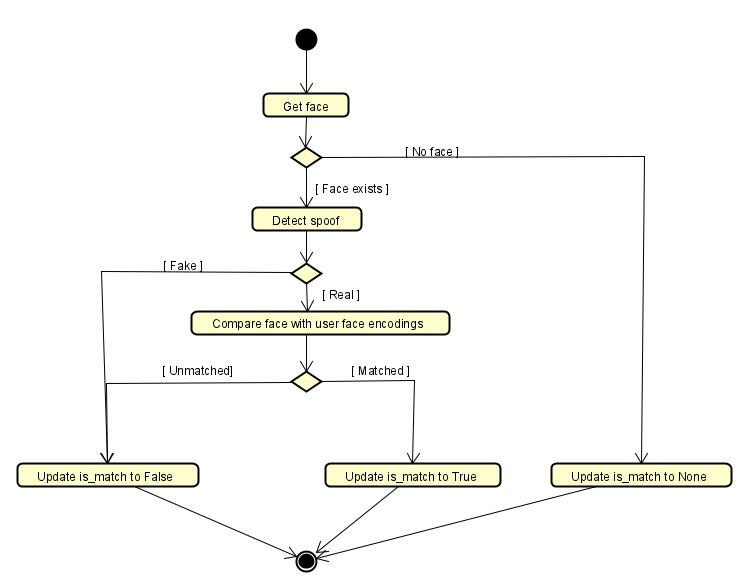
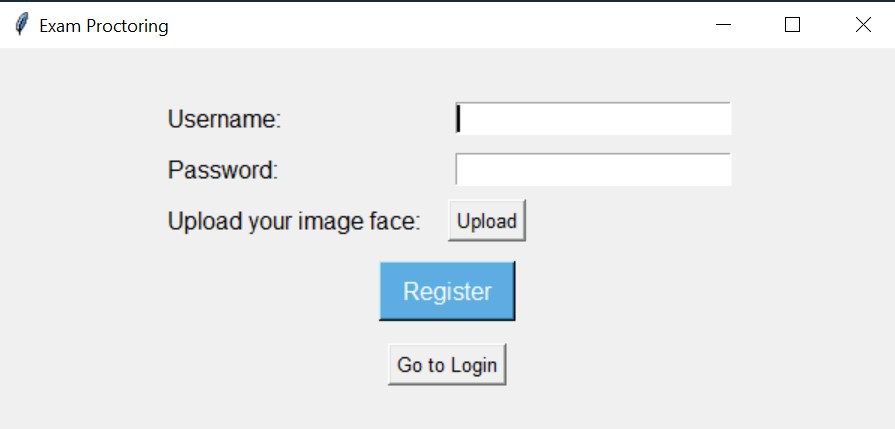
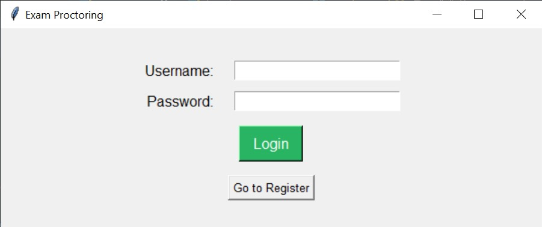

# Exam Proctoring

## Demo 

## How to use
1. `pip install -r requirements.txt`
2. `python main.py`

## Flow
### Flow of the application
Firstly, the user must log in successfully to access the app. Upon logging in, the user's face encoding, which was generated from the face image uploaded during registration, is retrieved. The main process then sequentially reads frames until the user presses 'q'.

To utilize the power of a multi-core CPU, two parallel processes are employed:

- One process (*processItems*) detects prohibited items (such as phones, headphones, etc.).
- Another process (*processFaces*) detects suspicious facial behaviors.

Both processes annotate the input frame directly, as it is a critical resource. The main process then displays the annotated frame.

Due to the time-consuming nature of anti-spoofing and face verification tasks, these are handled by a separate process called *verifyFace*. The *verifyFace* process frequently receives the raw face data detected by *processFaces*, performs verification, and updates the is_match field in the shared face_data.

Since the *verifyFace* process is not synchronized with *processItems* and *processFaces* at every frame, it does not impact the time taken to process each frame, ensuring smooth and efficient processing.

### Flow of processFaces

### Flow of verifyFace

## Features
- Registration:

- Log in:

- Prohibited items detection:

I choose *yolov8n* because of its small size and its ability to run real time in CPU, and train it on my custom [dataset](https://universe.roboflow.com/abc-ghsfm/tech-device-detection). The dataset contains 1753 images in 3 classes: phone, headphone, headset. Since the headset is small, the nano version of yolov8 makes many false positives about headset objects. Therefore, I only use the model for detecting phones.
- Face detection and landmarks: Mediapipe
- Head pose estimation
- Face occlusion detection:

To avoid the situation that user could use their hands or face masks to cover their mouth, I finetune a classifer based on MobileNetV2 to detect whether face is cover or not. I create the dataset by combining normal faces from [EasyPortrait](https://arxiv.org/abs/2304.13509) dataset and occluded faces from [MAFA](https://imsg.ac.cn/research/maskedface.html) dataset. The train set consists of 8456 images and the test set consists of 2208 images. The model achieves 98.27% accuracy on the test set. The dataset I used could be found [here](https://www.kaggle.com/datasets/lexuanhieuai/occluded-classification) and the notebook I used to train the model could be found [here](./face_occlusion_detection.ipynb)
- Open mouth detection
- Eye gaze estimation
- Face anti-spoofing: 

I choose use the trained model [DeePixBiS](https://github.com/Saiyam26/Face-Anti-Spoofing-using-DeePixBiS) for its small size and efficiency.
- Face verification: [face_recognition](https://github.com/ageitgey/face_recognition) library

